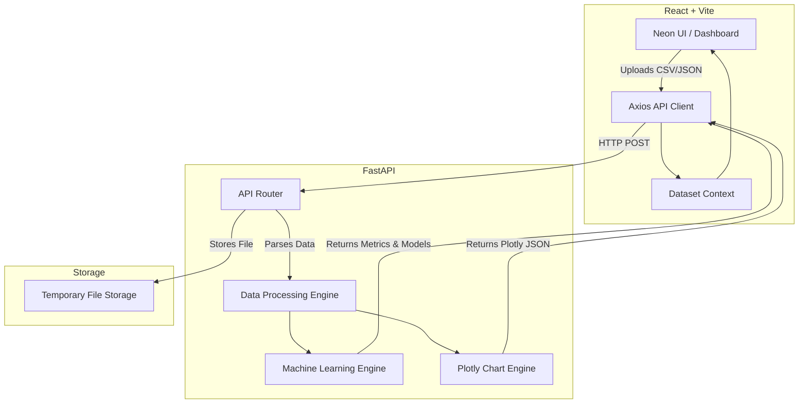
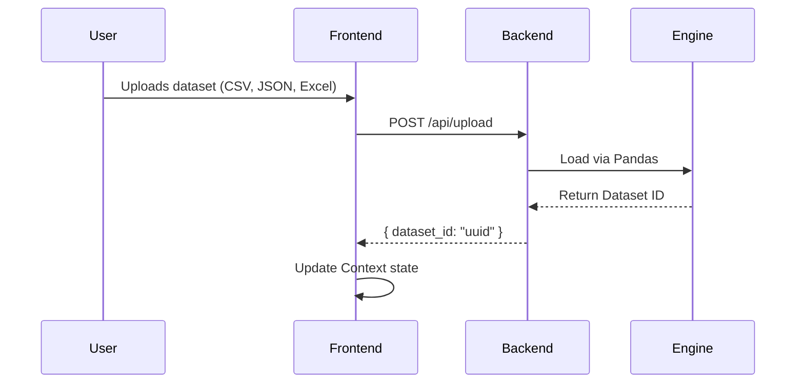

# 🌌 DataNova - AI-Powered Data Analytics Platform

DataNova is a cutting-edge, cyberpunk-themed Data Analytics and Machine Learning platform. It bridges the gap between raw data and actionable intelligence by providing a seamless, automated, and visually stunning web interface.

## ✨ Key Features
- **Automated EDA (Exploratory Data Analysis)**: Instantly generate statistical profiles, correlation matrices, and complex chart structures.
- **Cyberpunk Dashboard**: A stunning UI/UX designed with a dark neon aesthetic, rendering interactive Plotly charts natively.
- **Machine Learning Engine**: Run automated Regression, Classification, and Clustering algorithms with one click.
- **Data Quality Assessment**: Automatically detects missing values, duplicates, and anomalies in your dataset.
- **AI Investigation**: Chat with your data using an integrated LLM to ask questions and generate insights in plain English.

---

## 🏗️ System Architecture



---

## 🛠️ Technology Stack

| Component | Technology |
|---|---|
| **Frontend Framework** | React 18, Vite |
| **Styling** | Vanilla CSS, CSS Grid/Flexbox |
| **Icons** | Lucide-React |
| **Charts** | Plotly.js |
| **Backend Framework** | FastAPI (Python) |
| **Data Processing** | Pandas, NumPy |
| **Machine Learning** | Scikit-Learn |
| **Server** | Uvicorn |

---

## 🚀 How It Works

### 1. Data Ingestion workflow


### 2. Auto-Visualization
Once a dataset is uploaded, the frontend immediately fires requests to `/api/eda/charts`. The `Chart_Engine` infers column types and procedurally generates a comprehensive dashboard of:
- **Neon Trend Lines**: Smoothed lines with markers and gradient fills.
- **Data Node Maps**: Scatter plots mapped across dimensional clusters.
- **Solid Distributions**: Neon-colored pie charts and rounded-bar charts.

---

## 💻 Running Locally

### Prerequisites
- Node.js (v18+)
- Python (3.9+)

### Installation
1. Clone the repository:
   ```bash
   git clone https://github.com/Neel2109/Nova-Data-Analytics.git
   cd Nova-Data-Analytics
   ```

2. Install Backend Dependencies:
   ```bash
   pip install -r requirements.txt
   ```

3. Install Frontend Dependencies:
   ```bash
   npm install
   ```

### Execution
1. **Start the Backend** (FastAPI):
   ```bash
   uvicorn main:app --reload
   ```
   *The backend will run on `http://localhost:8000`*

2. **Start the Frontend** (Vite):
   ```bash
   npm run dev
   ```
   *The frontend will run on `http://localhost:5173` (or the next available port).*

---

## 🎨 Design Philosophy
DataNova rejects the standard "boring white dashboard" trope. By utilizing a deep `#02060E` background mixed with neon accents (`#1DE9B6` Teal, `#FF9100` Orange, `#FF4081` Pink), it creates an immersive experience that keeps analysts engaged. Plotly plots have been heavily customized to blend seamlessly with this sci-fi environment.
